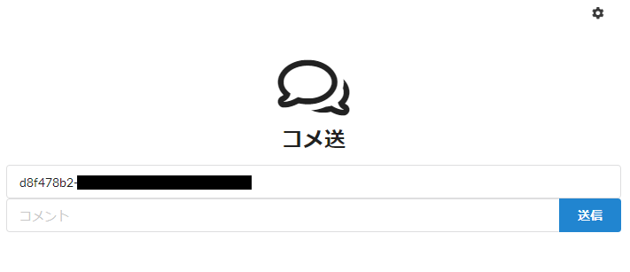
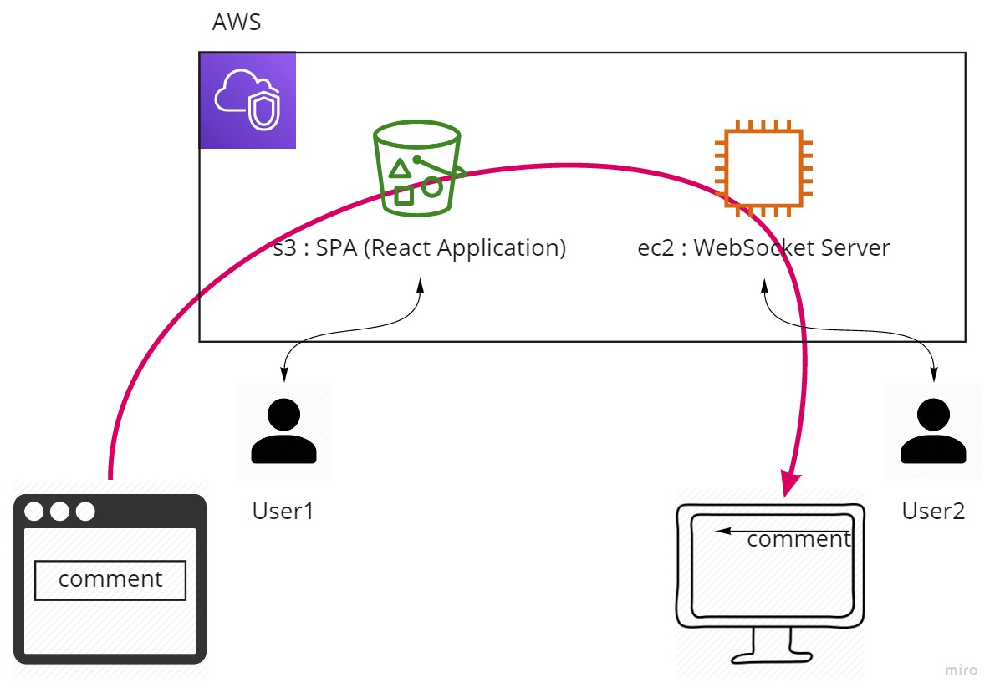

# come-sou-app

コメ送のElectronアプリ

## 詳細

画面上にニコニコ動画風コメントを流すためのデスクトップアプリケーション。
コメ送サーバとWebSocket通信をして、ブロードキャストされたメッセージを表示させる。
コメントを送るための入り口としてのViewや、ViewとApplicationを中継するためのサーバはこちらのリポジトリ（ https://github.com/jakelizzI/come-sou-server ）で管理しています。

### コメント送信入り口

- アプリケーションへコメントを送信するため入力場所です。
- 上のインプット欄にアプリの設定画面に表示されているUUIDを入力します。
- そこで入力したUUIDのアプリケーションへコメントが送信されます。

### アーキテクチャ

- User1はコメント送信側
- User2はアプリケーション側（コメントが流される側）

## 使い方

- ReleaseからOSに応じたものをDownloadします。 : https://github.com/jakelizzI/come-sou-app/releases/tag/0.2.0-alpha
- zipを解凍します。
- come-sou.exe/come-sou.appを起動します。
  - 画面右下に「終了」「設定」の順でアイコンが表示されます。
  - 設定から、適切な接続先URLを入力して「テスト接続」を行って下さい。
  - 無事接続されたら、設定画面上に接続済みと表示されます。

### デフォルト設定

- アプリケーション
  - 設定画面のデフォルトサーバ設定
    - host : ec2-54-65-94-81.ap-northeast-1.compute.amazonaws.com
    - port : 5001
- コメント送信
  - http://comesou-view.s3-ap-northeast-1.amazonaws.com/index.html

## 展望

* 起動と同時にLambdaをKickしてコメ送サーバとコメ送画面をコンテナで起動し、アプリケーション終了とともに破棄する仕組みを作成する。

---

# come-sou-app

Electron application for come-sou.

## detail

This is a desktop application for streaming Nico Nico Douga-style comments on your screen.
It communicates with the rice sending server and WebSocket to display the broadcasted message.
The View as an entry point for sending comments and relaying the View and Application The server to do so is this repository ( https://github.com/jakelizzI/come-sou-server ).

### comment submission entrance.

- This is where you enter the UUID to send comments to the application.
- Enter the UUID as it appears in the app's settings screen in the input field above.
- The comment will be sent to the application with the UUID you entered.

### Architecture.

- User1 is the sender of the comment
- User2 is the side of the application (the side to which comments are passed)

## how to use

- Download an OS-specific version from Release. : https://github.com/jakelizzI/come-sou-app/releases/tag/0.2.0-alpha
- Extract the zip.
- Launch the come-sou.exe/come-sou.app.
  - The icon appears in the lower right corner of the screen, followed by "Exit" and then "Settings".
  - Go to settings and enter the appropriate URL to connect to and make a "test connection".
  - If the connection is successfully made, it will be shown on the settings screen as connected.

### Default Settings.

- application
  - Default Server Settings in the Settings screen
    - host : ec2-54-65-94-81.ap-northeast-1.compute.amazonaws.com
    - port : 5001
- Send a comment
  - http://comesou-view.s3-ap-northeast-1.amazonaws.com/index.html

## outlook

Kick Lambda as soon as it starts up, and create a system that starts a rice delivery server and a rice delivery screen in a container and destroys it when the application ends.
